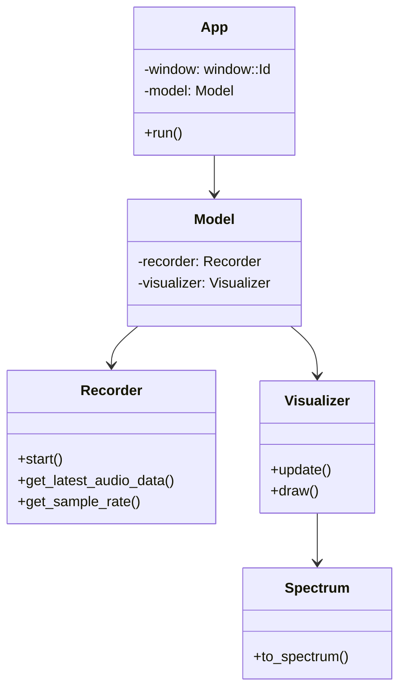

# PikaPulse
Simple speech to text note taking device

```mermaid
classDiagram
    class App {
        -window: window::Id
        -model: Model
        +run()
    }
    class Model {
        -recorder: Recorder
        -visualizer: Visualizer
    }
    class Recorder {
        +start()
        +get_latest_audio_data()
        +get_sample_rate()
    }
    class Visualizer {
        +update()
        +draw()
    }
    class Spectrum {
        +to_spectrum()
    }
    App --> Model
    Model --> Recorder
    Model --> Visualizer
    Visualizer --> Spectrum
```